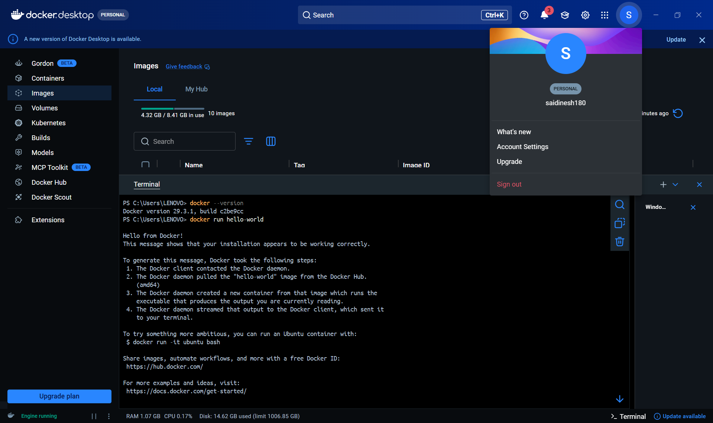
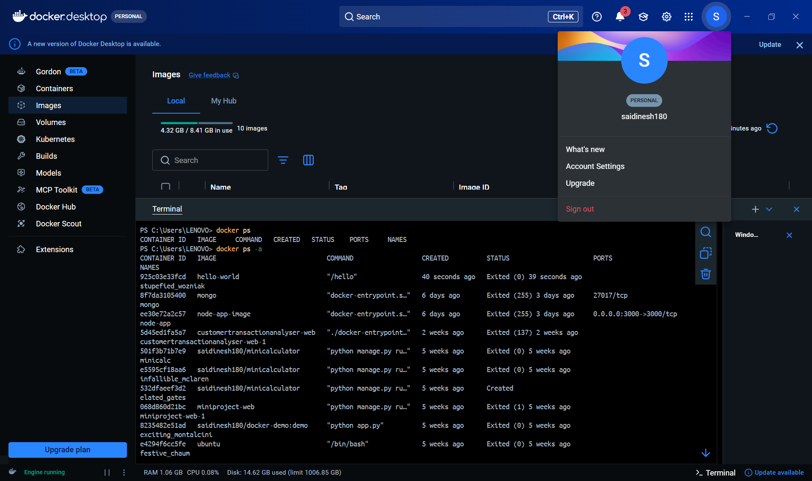
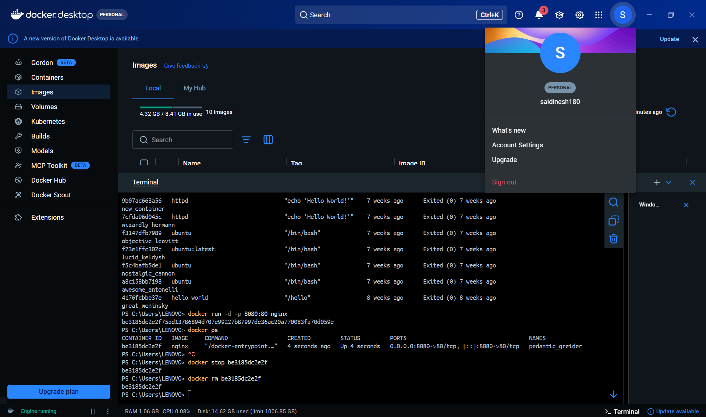
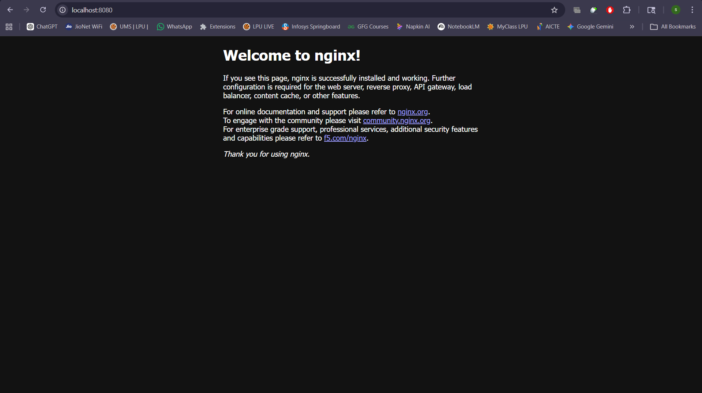

# 🔧 Practical 1 – Docker Installation and Basic Commands

---

## 🎯 Objective

To install Docker and perform basic container operations such as running containers, pulling images, and managing containers.

---

## 🧪 Commands Used

### 🔹 Check Docker Version

```bash
docker --version
```

---

### 🔹 Run Hello World Container

```bash
docker run hello-world
```

---

### 🔹 List Running Containers

```bash
docker ps
```

---

### 🔹 List All Containers

```bash
docker ps -a
```

---

### 🔹 Pull Nginx Image

```bash
docker pull nginx
```

---

### 🔹 Run Nginx Container

```bash
docker run -d -p 8080:80 nginx
```

---

### 🔹 Stop Container

```bash
docker stop <container_id>
```

---

### 🔹 Remove Container

```bash
docker rm <container_id>
```

---

## 📷 Execution Screenshots

### 1️⃣ Docker Version Check



---

### 2️⃣ Hello World Container Output



---

### 3️⃣ Nginx Container Running



---

### 4️⃣ Browser Output (Nginx Page)



---

## 📌 Expected Output

* Docker installed successfully
* Hello-world container runs without errors
* Nginx container runs in detached mode
* Nginx webpage accessible at: `http://localhost:8080`

---

## 🧠 Conclusion

Docker was successfully installed and verified. Basic commands such as pulling images, running containers, and managing container lifecycle were executed successfully. The Nginx container was deployed and accessed via a web browser, demonstrating practical container usage.

---
