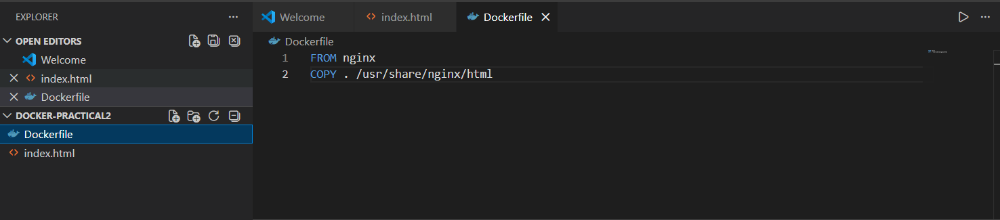
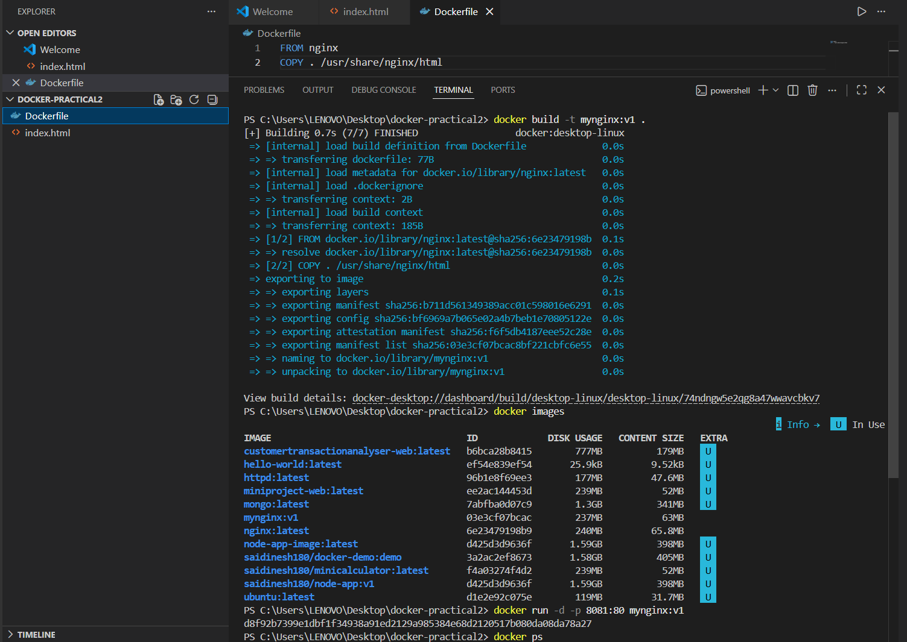
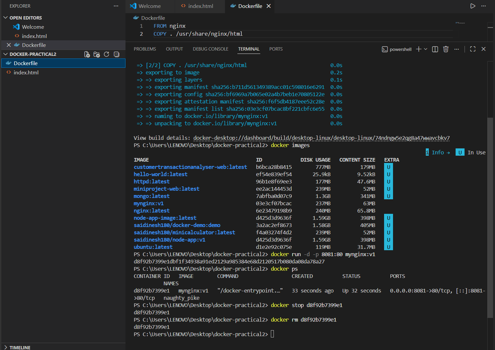
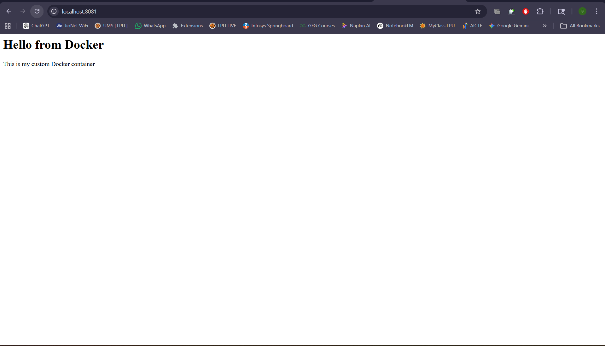

# 🔧 Practical 2 – Dockerfile and Image Creation

---

## 🎯 Objective

To create a custom Docker image using a Dockerfile and run a container from the built image.

---

## 🧪 Commands Used

### 🔹 Create Dockerfile

```dockerfile id="p2a1"
FROM nginx
COPY . /usr/share/nginx/html
```

---

### 🔹 Build Docker Image

```bash id="p2a2"
docker build -t mynginx:v1 .
```

---

### 🔹 List Docker Images

```bash id="p2a3"
docker images
```

---

### 🔹 Run Container from Custom Image

```bash id="p2a4"
docker run -d -p 8081:80 mynginx:v1
```

---

### 🔹 Stop Container

```bash id="p2a5"
docker stop <container_id>
```

---

### 🔹 Remove Container

```bash id="p2a6"
docker rm <container_id>
```

---

## 📷 Execution Screenshots

### 1️⃣ Dockerfile Creation



---

### 2️⃣ Image Build Process



---

### 3️⃣ Docker Images List & Running Container Output



---

### 5️⃣ Browser Output (Custom Nginx Page)



---

## 📌 Expected Output

* Docker image successfully built
* Image visible in `docker images`
* Container runs successfully on port 8081
* Custom webpage displayed in browser

---

## 🧠 Conclusion

A custom Docker image was successfully created using a Dockerfile. The image was built, verified, and used to run a container. The application was deployed and accessed via the browser, demonstrating practical understanding of Docker image creation and container execution.

---
