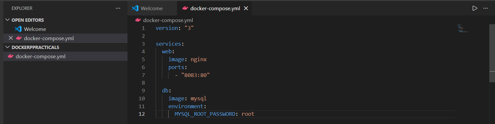
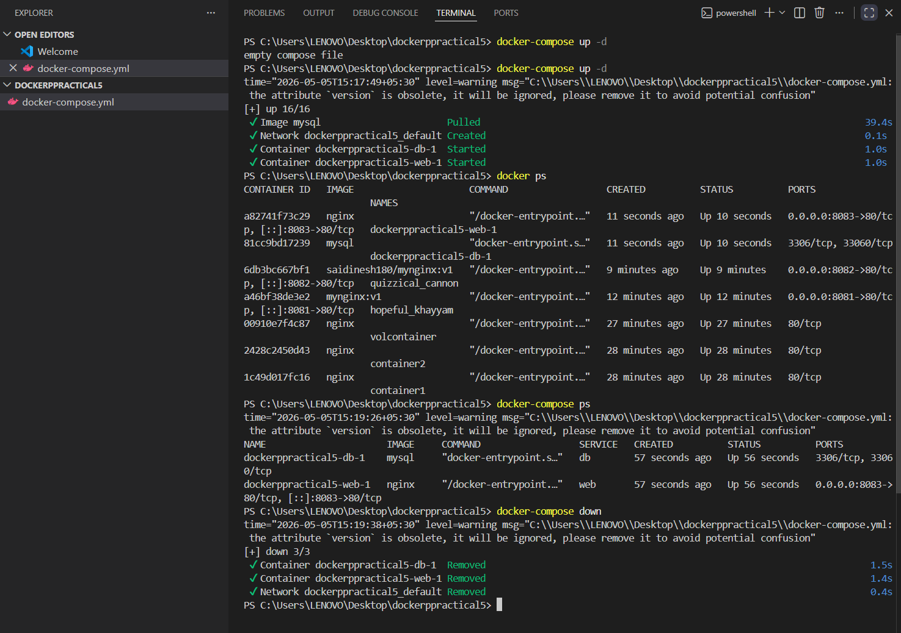

# 🔧 Practical 5 – Docker Compose (Multi-Container Application)

---

## 🎯 Objective

To deploy and manage a multi-container application using Docker Compose.

---

## 🧠 Concepts Covered

* Docker Compose
* Multi-container architecture
* Service configuration
* Container orchestration

---

## 🧪 Commands Used

### 🔹 Create Project Directory

```bash id="p5a1"
mkdir docker-practical5
cd docker-practical5
```

---

### 🔹 Create Docker Compose File

```bash id="p5a2"
notepad docker-compose.yml
```

---

### 🔹 Docker Compose Configuration

```yaml id="p5a3"
version: "3"

services:
  web:
    image: nginx
    ports:
      - "8083:80"

  db:
    image: mysql
    environment:
      MYSQL_ROOT_PASSWORD: root
```

---

### 🔹 Start Services

```bash id="p5a4"
docker-compose up -d
```

---

### 🔹 List Running Containers

```bash id="p5a5"
docker ps
```

---

### 🔹 Check Compose Services

```bash id="p5a6"
docker-compose ps
```

---

### 🔹 Stop Services

```bash id="p5a7"
docker-compose down
```

---

## 📷 Execution Screenshots

### 1️⃣ Docker Compose Up



---

### 2️⃣ Running Containers



---

### 3️⃣ Browser Output (Nginx Service)


---

### 4️⃣ Docker Compose Services Status


---

### 5️⃣ Docker Compose Down


---

## 📌 Expected Output

* Docker Compose file created successfully
* Multiple containers (web + db) running
* Services accessible via defined ports
* Containers managed collectively using Docker Compose

---

## 🧠 Conclusion

Docker Compose simplifies the deployment of multi-container applications by defining services in a single configuration file. It enables efficient orchestration, networking, and management of containers, making it a key tool in modern DevOps workflows.

---

