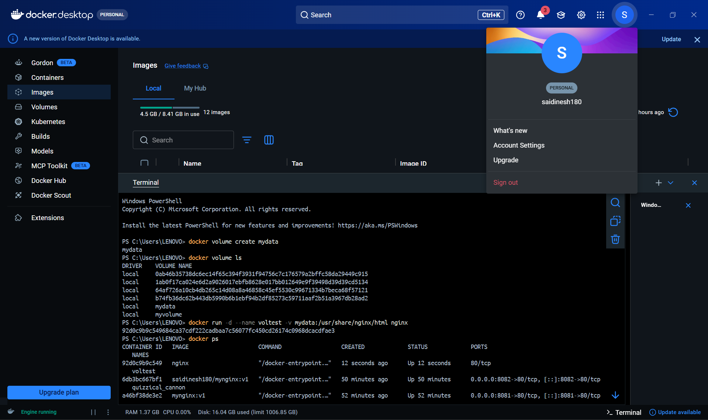
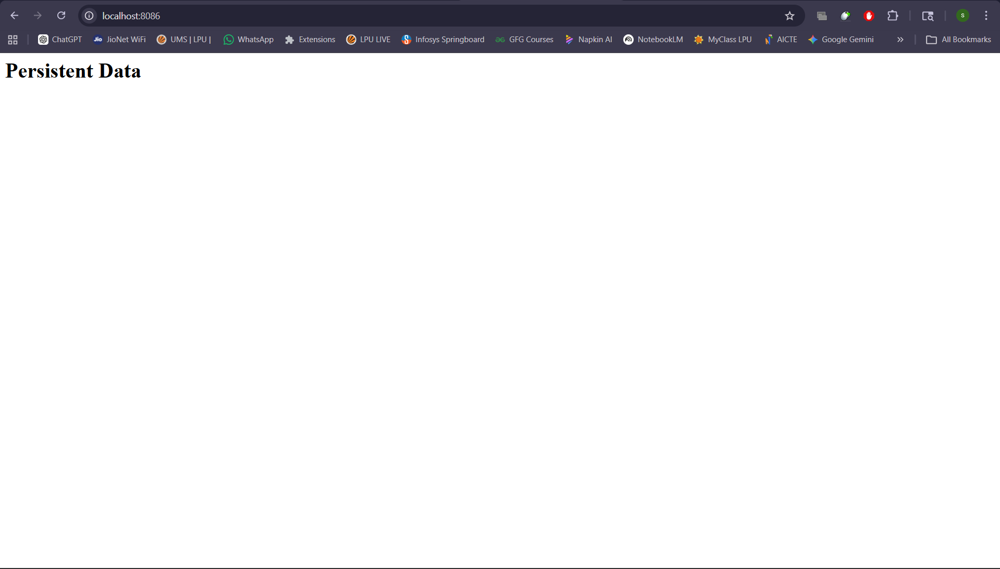
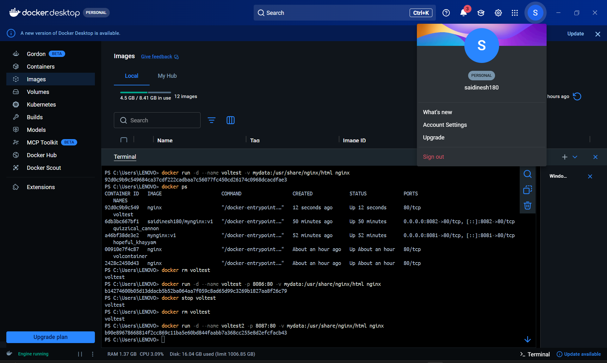
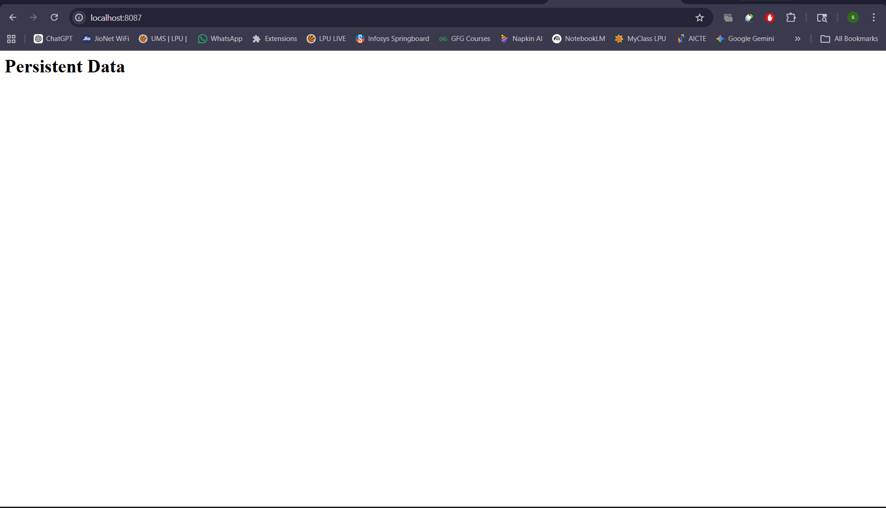

# 🔧 Practical 6 – Docker Volumes and Data Persistence

---

## 🎯 Objective

To understand and implement Docker volumes for persistent data storage across container lifecycles.

---

## 🧠 Concepts Covered

* Docker Volumes
* Data Persistence
* Volume Mounting
* Container Lifecycle

---

## 🧪 Commands Used

### 🔹 Create Volume

```bash
docker volume create mydata
```

---

### 🔹 List Volumes

```bash
docker volume ls
```

---

### 🔹 Run Container with Volume

```bash
docker run -d --name voltest -v mydata:/app nginx
```

---

### 🔹 Inspect Volume

```bash
docker volume inspect mydata
```

---

### 🔹 Stop Container

```bash
docker stop voltest
```

---

### 🔹 Remove Container

```bash
docker rm voltest
```

---

### 🔹 Re-run Container with Same Volume

```bash
docker run -d --name voltest2 -v mydata:/app nginx
```

---

## 📷 Execution Screenshots

### 1️⃣ Volume Creation



---

### 2️⃣ Volume List


---

### 3️⃣ Container with Volume



---

### 4️⃣ Volume Inspection



---

### 5️⃣ Reused Volume in New Container



---

## 📌 Expected Output

* Volume created successfully
* Volume persists even after container removal
* Data remains intact across container instances

---

## 🧠 Conclusion

Docker volumes provide persistent storage independent of container lifecycle. They are essential for applications requiring data durability such as databases and logs.

---
